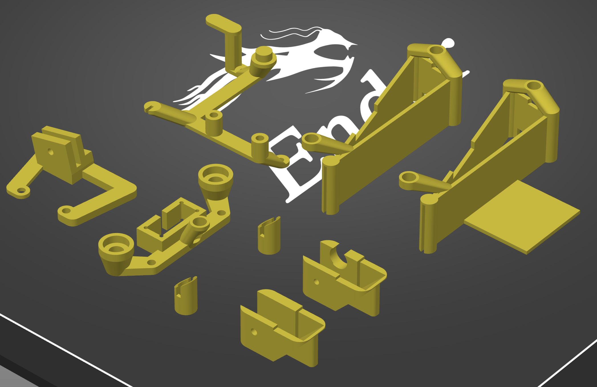

# orochi-superlite
A clean weight reduction mod for the Razer Orochi v2.

Massive props to Razer for releasing such a good mouse!

If you liked or used this design, consider supporting me here: https://www.buymeacoffee.com/stingray127

## Background

The goal of this mod was to nondestructively reduce the weight of the mouse while maintaining functionality and structural integrity.

The stock mouse is made of 3 main parts: Lower Shell, Upper Shell, and Inner Skeleton.

I removed the Inner Skeleton of the mouse and replaced all its functions with various 3D printed parts.

This image shows the correct orientation for printing each part.

## Suggested Usage

I don't really recommend going for the Lipo variant unless you really know what you are doing. I had to crack a Lipo AA battery apart to harvest its charging circuit, which should be done with extreme caution. I also directly soldered Lipo connections to the charging circuit, but you could also just source and solder a battery connection to the circuit.

LR44 or 675 Button cells are much safer to work with. Get or print a button cell holder, and desolder the battery cable from the Inner Skeleton part of the stock Orochi, and you're in business.

<!-- ## Functional Descriptions

botscaffold:
- Prevents the scroll wheel from popping up
- Holds the daughterboard in place so the side buttons are usable
- Provides anchor points for topscaffold

anticrush:
- Prevents the user from crushing the walls of the Lower Shell inwards
- Provides 2 indexing points for the Upper Shell

magnetandindexing:
- Keeps the top shell on using the same magnet attachment system as the stock mouse
- Provide a third indexing point for the Upper Shell

cannoli:
- Limits the amount of post travel for clicks
- Prevents Upper Shell from popping off during hard presses of the mouse buttons (top shell used to pop every time I tried to spray transfer)

rhino:
- Holds the charging circuit I used in the lipo variant of the mod
- Acts as a dpi button

topscaffold:
- Puts the rhino at the right location
- Flexes when pressure is applied on the rhino horn to press the DPI button on the daughterboard -->
